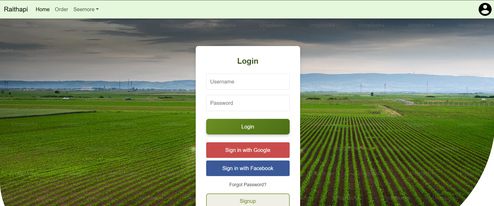

This project utilizes CNN, OpenCV, wavelets, Random Forest, and Decision Tree to accurately predict 38 classes of plant diseases. By leveraging deep learning and machine learning techniques, the model helps in early detection and classification of plant diseases
